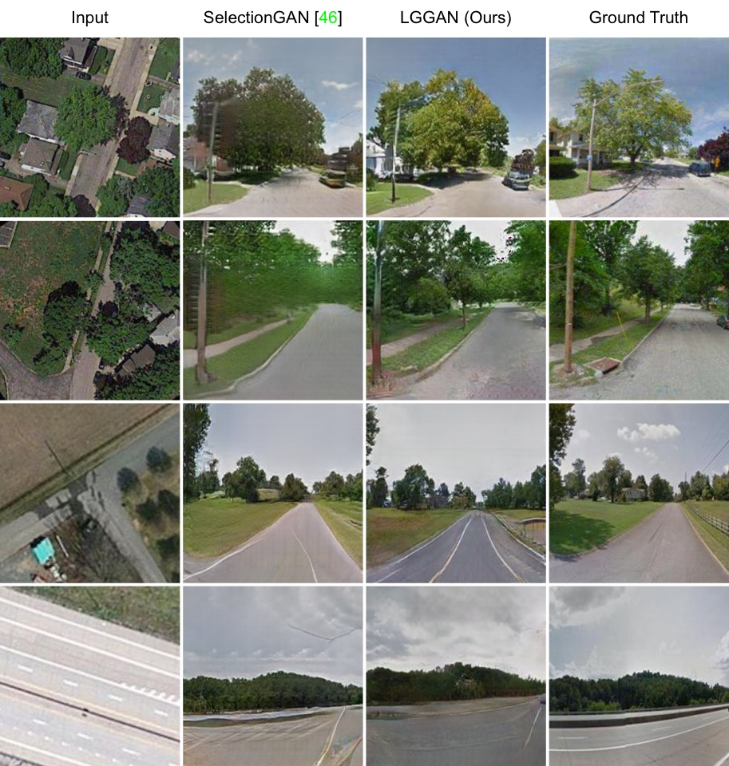
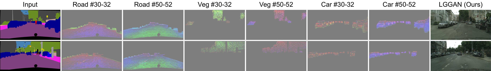

[](https://github.com/Ha0Tang/LGGAN/blob/master/LICENSE.md)


[]((https://github.com/Ha0Tang/LGGAN/graphs/commit-activity))


## Contents
  - [Local and Global GAN](#Local-and-Global-GAN)
  - [Cross-View Image Translation](#Cross-View-Image-Translation)
  - [Semantic Image Synthesis](#Semantic-Image-Synthesis)
  - [Acknowledgments](#Acknowledgments)
  - [Related Projects](#Related-Projects)
  - [Citation](#Citation)
  - [Contributions](#Contributions)
  - [Collaborations](#Collaborations)

## Local and Global GAN

**[Local Class-Specific and Global Image-Level Generative Adversarial Networks for Semantic-Guided Scene Generation](https://arxiv.org/abs/1912.12215)**  
[Hao Tang](http://disi.unitn.it/~hao.tang/), [Dan Xu](http://www.robots.ox.ac.uk/~danxu/), [Yan Yan](https://userweb.cs.txstate.edu/~y_y34/), [Philip H.S. Torr](https://scholar.google.com/citations?user=kPxa2w0AAAAJ&hl=en), [Nicu Sebe](https://scholar.google.com/citations?user=stFCYOAAAAAJ&hl=en).
<br>In [CVPR 2020](http://cvpr2020.thecvf.com/).<br>
The repository offers the official implementation of our paper in PyTorch.

In the meantime, check out our related ACM MM 2020 paper [Dual Attention GANs for Semantic Image Synthesis](https://github.com/Ha0Tang/DAGAN), and Arxiv paper [Edge Guided GANs with Semantic Preserving for Semantic Image Synthesis](https://github.com/Ha0Tang/EdgeGAN).

### Framework


### Cross-View Image Translation Results on Dayton and CVUSA
<center>

</center>

### Semantic Image Synthesis Results on Cityscapes and ADE20K


### Generated Segmentation Maps on Cityscapes


### Generated Segmentation Maps on ADE20K


### Generated Feature Maps on Cityscapes



### [License](./LICENSE.md)
<a rel="license" href="http://creativecommons.org/licenses/by-nc-sa/4.0/"></a><br />
Copyright (C) 2020 University of Trento, Italy.

All rights reserved.
Licensed under the [CC BY-NC-SA 4.0](https://creativecommons.org/licenses/by-nc-sa/4.0/legalcode) (**Attribution-NonCommercial-ShareAlike 4.0 International**)

The code is released for academic research use only. For commercial use, please contact [bjdxtanghao@gmail.com](bjdxtanghao@gmail.com).

## Cross-View Image Translation
Please refer to the [cross_view_translation](https://github.com/Ha0Tang/LGGAN/tree/master/cross_view_translation) folder for more details.

## Semantic Image Synthesis
Please refer to the [semantic_image_synthesis](https://github.com/Ha0Tang/LGGAN/tree/master/semantic_image_synthesis) folder for more details.

## Acknowledgments
This source code of cross-view image translation is inspired by [SelectionGAN](https://github.com/Ha0Tang/SelectionGAN), the source code of semantic image synthsis is inspired by [GauGAN/SPADE](https://github.com/NVlabs/SPADE).

## Related Projects
**[SelectionGAN](https://github.com/Ha0Tang/SelectionGAN) | [EdgeGAN](https://github.com/Ha0Tang/EdgeGAN) | [DPGAN](https://github.com/Ha0Tang/DPGAN) | [DAGAN](https://github.com/Ha0Tang/DAGAN) | [PanoGAN](https://github.com/sswuai/PanoGAN) | [Guided-I2I-Translation-Papers](https://github.com/Ha0Tang/Guided-I2I-Translation-Papers)**

## Citation
If you use this code for your research, please cite our papers.

LGGAN
```
@article{tang2022local,
  title={Local and Global GANs with Semantic-Aware Upsampling for Image Generation},
  author={Tang, Hao and Shao, Ling and Torr, Philip HS and Sebe, Nicu},
  journal={IEEE Transactions on Pattern Analysis and Machine Intelligence (TPAMI)},
  year={2022}
}

@inproceedings{tang2019local,
  title={Local Class-Specific and Global Image-Level Generative Adversarial Networks for Semantic-Guided Scene Generation},
  author={Tang, Hao and Xu, Dan and Yan, Yan and Torr, Philip HS and Sebe, Nicu},
  booktitle={CVPR},
  year={2020}
}
```

DPGAN
```
@article{tang2021layout,
  title={Layout-to-image translation with double pooling generative adversarial networks},
  author={Tang, Hao and Sebe, Nicu},
  journal={IEEE Transactions on Image Processing (TIP)},
  volume={30},
  pages={7903--7913},
  year={2021}
}
```

EdgeGAN
```
@article{tang2020edge,
  title={Edge Guided GANs with Semantic Preserving for Semantic Image Synthesis},
  author={Tang, Hao and Qi, Xiaojuan and Xu, Dan and Torr, Philip HS and Sebe, Nicu},
  journal={arXiv preprint arXiv:2003.13898},
  year={2020}
}
```

DAGAN
```
@inproceedings{tang2020dual,
  title={Dual Attention GANs for Semantic Image Synthesis},
  author={Tang, Hao and Bai, Song and Sebe, Nicu},
  booktitle ={ACM MM},
  year={2020}
}
```

SelectionGAN
```
@inproceedings{tang2019multi,
  title={Multi-channel attention selection gan with cascaded semantic guidance for cross-view image translation},
  author={Tang, Hao and Xu, Dan and Sebe, Nicu and Wang, Yanzhi and Corso, Jason J and Yan, Yan},
  booktitle={CVPR},
  year={2019}
}

@article{tang2020multi,
  title={Multi-channel attention selection gans for guided image-to-image translation},
  author={Tang, Hao and Xu, Dan and Yan, Yan and Corso, Jason J and Torr, Philip HS and Sebe, Nicu},
  journal={arXiv preprint arXiv:2002.01048},
  year={2020}
}
```

## Contributions
If you have any questions/comments/bug reports, feel free to open a github issue or pull a request or e-mail to the author Hao Tang ([bjdxtanghao@gmail.com](bjdxtanghao@gmail.com)).

## Collaborations
I'm always interested in meeting new people and hearing about potential collaborations. If you'd like to work together or get in contact with me, please email bjdxtanghao@gmail.com. Some of our projects are listed [here](https://github.com/Ha0Tang).
___
*If you really want to do something, you'll find a way. If you don't, you'll find an excuse.*
