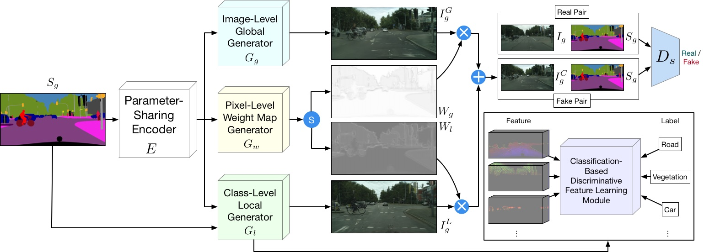
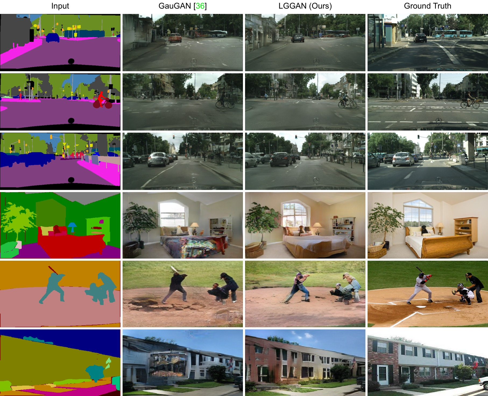
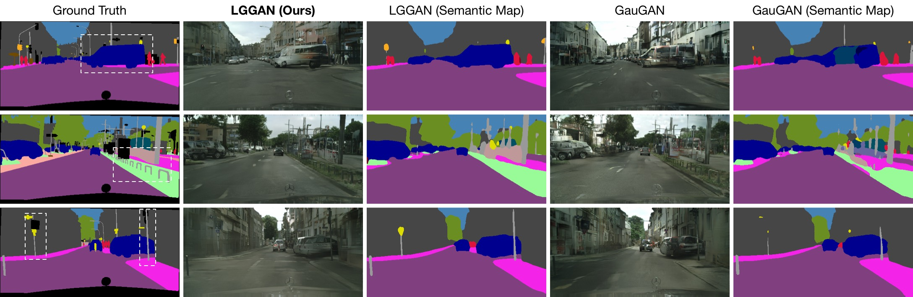

## Local and Global GAN

**[Local Class-Specific and Global Image-Level Generative Adversarial Networks for Semantic-Guided Scene Generation](https://arxiv.org/abs/1912.12215)**  
[Hao Tang](http://disi.unitn.it/~hao.tang/), [Dan Xu](http://www.robots.ox.ac.uk/~danxu/), [Yan Yan](https://userweb.cs.txstate.edu/~y_y34/), [Philip H.S. Torr](https://scholar.google.com/citations?user=kPxa2w0AAAAJ&hl=en), [Nicu Sebe](https://scholar.google.com/citations?user=stFCYOAAAAAJ&hl=en).
<br>In [CVPR 2020](http://cvpr2020.thecvf.com/).

## Framework


## Results



<br>



<br>


## Related Projects
**[SelectionGAN](https://github.com/Ha0Tang/SelectionGAN) | [EdgeGAN](https://github.com/Ha0Tang/EdgeGAN) | [Guided-I2I-Translation-Papers](https://github.com/Ha0Tang/Guided-I2I-Translation-Papers)**

## Citation
If you use this code for your research, please cite our papers.

EdgeGAN
```
@article{tang2020edge,
  title={Edge Guided GANs with Semantic Preserving for Semantic Image Synthesis},
  author={Tang, Hao and Qi, Xiaojuan and Xu, Dan and Torr, Philip HS and Sebe, Nicu},
  journal={arXiv preprint arXiv:2003.13898},
  year={2020}
}
```

LGGAN
```
@inproceedings{tang2019local,
  title={Local Class-Specific and Global Image-Level Generative Adversarial Networks for Semantic-Guided Scene Generation},
  author={Tang, Hao and Xu, Dan and Yan, Yan and Torr, Philip HS and Sebe, Nicu},
  booktitle={CVPR},
  year={2020}
}
```

SelectionGAN
```
@inproceedings{tang2019multi,
  title={Multi-channel attention selection gan with cascaded semantic guidance for cross-view image translation},
  author={Tang, Hao and Xu, Dan and Sebe, Nicu and Wang, Yanzhi and Corso, Jason J and Yan, Yan},
  booktitle={CVPR},
  year={2019}
}

@article{tang2020multi,
  title={Multi-channel attention selection gans for guided image-to-image translation},
  author={Tang, Hao and Xu, Dan and Yan, Yan and Corso, Jason J and Torr, Philip HS and Sebe, Nicu},
  journal={arXiv preprint arXiv:2002.01048},
  year={2020}
}
```

## We will release the code and pre-trained models soon. Make sure to star our repository to stay tuned.
