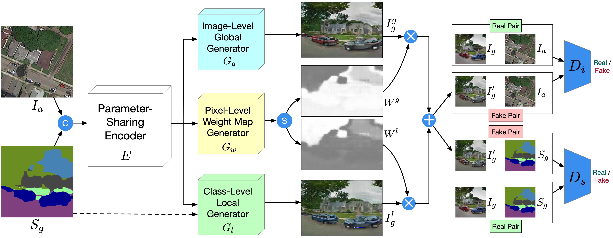
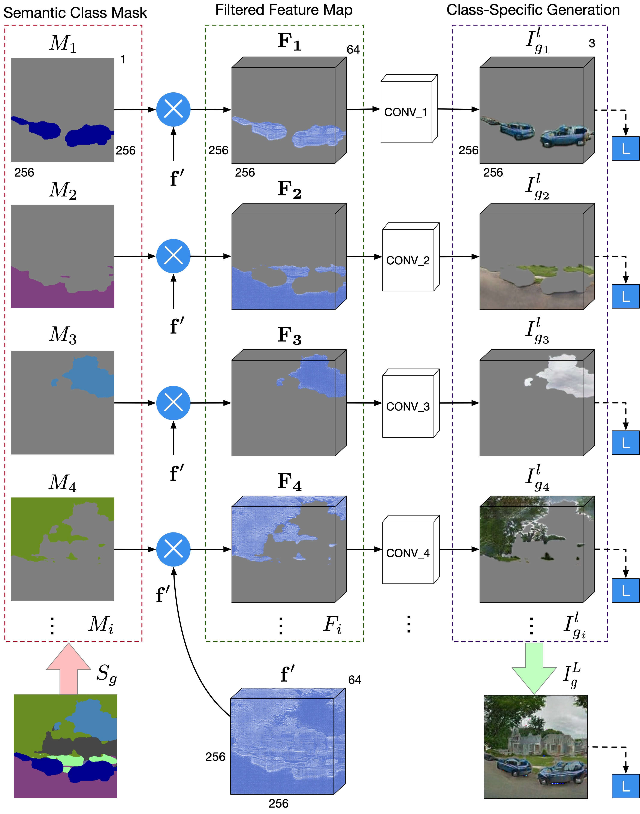

[](https://raw.githubusercontent.com/nvlabs/SPADE/master/LICENSE.md)

[]()


# Local and Global GAN (LGGAN) for Cross-View Image Translation

## LGGAN Framework


## Local Class-Specific Generator
<p align="center">
  
</p>

### [Paper (Coming soon!)](https://arxiv.org/abs/1808) | [Project page](http://disi.unitn.it/~hao.tang/project/LocalGlobalGAN.html)

Joint Adversarial Learning Local Class-Specific and Global Image-Level Generation for Cross-View Image Translation.<br>
[Hao Tang](http://disi.unitn.it/~hao.tang/)<sup>1</sup>, [Dan Xu](http://www.robots.ox.ac.uk/~danxu/)<sup>2</sup>, [Jason J. Corso](https://scholar.google.com/citations?user=g9bV-_sAAAAJ&hl=en)<sup>3</sup>, [Nicu Sebe](https://scholar.google.com/citations?user=stFCYOAAAAAJ&hl=en)<sup>1,4</sup> and [Yan Yan](https://userweb.cs.txstate.edu/~y_y34/)<sup>5</sup>. <br> 
<sup>1</sup>University of Trento, Italy, <sup>2</sup>University of Oxford, UK, <sup>3</sup>University of Michigan, USA, <sup>4</sup>Huawei Technologies Ireland, Ireland, <sup>5</sup>Texas State University, USA.<br>
In 2019.<br>
The repository offers the implementation of our paper in PyTorch.


GestureGAN for cross-view image tranlation task. Given an image and some novel semantic maps, GestureGAN is able
to generate the same scene but with different viewpoints.

### [License](./LICENSE.md)

Copyright (C) 2019 University of Trento, Italy.

All rights reserved.
Licensed under the [CC BY-NC-SA 4.0](https://creativecommons.org/licenses/by-nc-sa/4.0/legalcode) (**Attribution-NonCommercial-ShareAlike 4.0 International**)

The code is released for academic research use only. For commercial use, please contact [hao.tang@unitn.it](hao.tang@unitn.it).

## Installation

Clone this repo.
```bash
git clone https://github.com/Ha0Tang/LocalGlobalGAN
cd LocalGlobalGAN/
```

This code requires PyTorch 0.4.1 and python 3.6+. Please install dependencies by
```bash
pip install -r requirements.txt (for pip users)
```
or 

```bash
./scripts/conda_deps.sh (for Conda users)
```

To reproduce the results reported in the paper, you would need a NVIDIA GeForce GTX 1080 Ti GPUs.

## Dataset Preparation

For SVA, Dayton or CVUSA, the datasets must be downloaded beforehand. Please download them on the respective webpages. In addition, we put a few sample images in this [code repo](https://github.com/Ha0Tang/LocalGlobalGAN/tree/master/datasets/samples). Please cite their papers if you use the data. 

**Preparing SVA Dataset**. The dataset can be downloaded [here](http://imagelab.ing.unimore.it/imagelab/page.asp?IdPage=19).
Ground Truth semantic maps are not available for this datasets. We adopt [RefineNet](https://github.com/guosheng/refinenet) trained on CityScapes dataset for generating semantic maps and use them as training data in our experiments. Please cite their papers if you use this dataset.
Train/Test splits for Dayton dataset can be downloaded from [here](https://github.com/Ha0Tang/LocalGlobalGAN/tree/master/datasets/sva_split).

**Preparing Dayton Dataset**. The dataset can be downloaded [here](https://github.com/lugiavn/gt-crossview). In particular, you will need to download dayton.zip. 
Ground Truth semantic maps are not available for this datasets. We adopt [RefineNet](https://github.com/guosheng/refinenet) trained on CityScapes dataset for generating semantic maps and use them as training data in our experiments. Please cite their papers if you use this dataset.
Train/Test splits for Dayton dataset can be downloaded from [here](https://github.com/Ha0Tang/SelectionGAN/tree/master/datasets/dayton_split).

**Preparing CVUSA Dataset**. The dataset can be downloaded [here](https://drive.google.com/drive/folders/0BzvmHzyo_zCAX3I4VG1mWnhmcGc), which is from the [page](http://cs.uky.edu/~jacobs/datasets/cvusa/). After unzipping the dataset, prepare the training and testing data as discussed in [SelectionGAN](https://arxiv.org/abs/1904.06807). We also convert semantic maps to the color ones by using this [script](https://github.com/Ha0Tang/SelectionGAN/blob/master/scripts/convert_semantic_map_cvusa.m).
Since there is no semantic maps for the aerial images on this dataset, we use black images as aerial semantic maps for placehold purposes.

**Preparing Your Own Datasets**. Each training sample in the dataset will contain {Ia,Ig,Sa,Sg}, where Ia=aerial image, Ig=ground image, Sa=semantic map for aerial image and Sg=semantic map for ground image. Of course, you can use LGGAN for your own datasets and tasks.

## Generating Images Using Pretrained Model

Once the dataset is ready. The result images can be generated using pretrained models.

1. You can download a pretrained model (e.g. sva) with the following script:

```
bash ./scripts/download_lggan_model.sh sva
```
The pretrained model is saved at `./checkpoints/[type]_pretrained`. Check [here](https://github.com/Ha0Tang/LocalGlobalGAN/blob/master/scripts/download_lggan_model.sh) for all the available GestureGAN models.

2. Generate images using the pretrained model.
```bash
python test.py --dataroot [path_to_dataset] --name [type]_pretrained --model [gesturegan_model] --which_model_netG resnet_9blocks --which_direction AtoB --dataset_mode aligned --norm batch --gpu_ids 0 --batchSize [BS] --loadSize [LS] --fineSize [FS] --no_flip;
```

`[path_to_dataset]` is the path to the dataset. Dataset can be one of `ntu`, `senz3d`, `dayton_a2g`, `dayton_g2a` and `cvusa`. `[type]_pretrained` is the directory name of the checkpoint file downloaded in Step 1, which should be one of `ntu_gesturegan_twocycle_pretrained`, `senz3d_gesturegan_twocycle_pretrained`, `dayton_a2g_64_gesturegan_onecycle_pretrained`, `dayton_g2a_64_gesturegan_onecycle_pretrained`, `dayton_a2g_gesturegan_onecycle_pretrained`, `dayton_g2a_gesturegan_onecycle_pretrained` and `cvusa_gesturegan_onecycle_pretrained`. 
`[gesturegan_model]` is the directory name of the model of GestureGAN, which should be one of `gesturegan_twocycle` or `gesturegan_onecycle`.
If you are running on CPU mode, change `--gpu_ids 0` to `--gpu_ids -1`. For [`BS`, `LS`, `FS`], please see `Training` and `Testing` sections.

Note that testing require large amount of disk space. If you don't have enough space, append `--saveDisk` on the command line.
    
3. The outputs images are stored at `./results/[type]_pretrained/` by default. You can view them using the autogenerated HTML file in the directory.

## Training New Models

New models can be trained with the following commands.

1. Prepare dataset. 

2. Train.

For NTU dataset:
```bash
export CUDA_VISIBLE_DEVICES=3,4;
python train.py --dataroot ./datasets/ntu --name ntu_gesturegan_twocycle --model gesturegan_twocycle --which_model_netG resnet_9blocks --which_direction AtoB --dataset_mode aligned --norm instance --gpu_ids 0,1 --batchSize 4 --loadSize 286 --fineSize 256 --no_flip --lambda_L1 800 --cyc_L1 0.1 --lambda_identity 0.01 --lambda_feat 1000 --display_id 0 --niter 10 --niter_decay 10;
```

For Senz3D dataset:
```bash
export CUDA_VISIBLE_DEVICES=5,7;
python train.py --dataroot ./datasets/senz3d --name senz3d_gesturegan_twocycle --model gesturegan_twocycle --which_model_netG resnet_9blocks --which_direction AtoB --dataset_mode aligned --norm instance --gpu_ids 0,1 --batchSize 4 --loadSize 286 --fineSize 256 --no_flip --lambda_L1 800 --cyc_L1 0.1 --lambda_identity 0.01 --lambda_feat 1000 --display_id 0 --niter 10 --niter_decay 10;
```

For CVUSA dataset:
```bash
export CUDA_VISIBLE_DEVICES=0;
python train.py --dataroot ./dataset/cvusa --name cvusa_gesturegan_onecycle --model gesturegan_onecycle --which_model_netG resnet_9blocks --which_direction AtoB --dataset_mode aligned --norm instance --gpu_ids 0 --batchSize 4 --loadSize 286 --fineSize 256 --no_flip --cyc_L1 0.1 --lambda_identity 100 --lambda_feat 100 --display_id 0 --niter 15 --niter_decay 15;
```

For Dayton (a2g direction, 256) dataset:
```bash
export CUDA_VISIBLE_DEVICES=0;
python train.py --dataroot ./datasets/dayton_a2g --name dayton_a2g_gesturegan_onecycle --model gesturegan_onecycle --which_model_netG resnet_9blocks --which_direction AtoB --dataset_mode aligned --norm instance --gpu_ids 0 --batchSize 4 --loadSize 286 --fineSize 256 --no_flip --cyc_L1 0.1 --lambda_identity 100 --lambda_feat 100 --display_id 0 --niter 20 --niter_decay 15;
```

For Dayton (g2a direction, 256) dataset:
```bash
export CUDA_VISIBLE_DEVICES=1;
python train.py --dataroot ./datasets/dayton_g2a --name dayton_g2a_gesturegan_onecycle --model gesturegan_onecycle --which_model_netG resnet_9blocks --which_direction AtoB --dataset_mode aligned --norm instance --gpu_ids 0 --batchSize 4 --loadSize 286 --fineSize 256 --no_flip --cyc_L1 0.1 --lambda_identity 100 --lambda_feat 100 --display_id 0 --niter 20 --niter_decay 15;
```

For Dayton (a2g direction, 64) dataset:
```bash
export CUDA_VISIBLE_DEVICES=0;
python train.py --dataroot ./datasets/dayton_a2g --name dayton_a2g_64_gesturegan_onecycle --model gesturegan_onecycle --which_model_netG resnet_9blocks --which_direction AtoB --dataset_mode aligned --norm instance --gpu_ids 0 --batchSize 16 --loadSize 72 --fineSize 64 --no_flip --cyc_L1 0.1 --lambda_identity 100 --lambda_feat 100 --display_id 0 --niter 50 --niter_decay 50;
```

For Dayton (g2a direction, 64) dataset:
```bash
export CUDA_VISIBLE_DEVICES=1;
python train.py --dataroot ./datasets/dayton_g2a --name dayton_g2a_64_gesturegan_onecycle --model gesturegan_onecycle --which_model_netG resnet_9blocks --which_direction AtoB --dataset_mode aligned --norm instance --gpu_ids 0 --batchSize 16 --loadSize 72 --fineSize 64 --no_flip --cyc_L1 0.1 --lambda_identity 100 --lambda_feat 100 --display_id 0 --niter 50 --niter_decay 50;
```

There are many options you can specify. Please use `python train.py --help`. The specified options are printed to the console. To specify the number of GPUs to utilize, use `export CUDA_VISIBLE_DEVICES=[GPU_ID]`. Note that train `gesturegan_onecycle` only needs one GPU, while train `gesturegan_twocycle` needs two GPUs.

To view training results and loss plots on local computers, set `--display_id` to a non-zero value and run `python -m visdom.server` on a new terminal and click the URL [http://localhost:8097](http://localhost:8097/).
On a remote server, replace `localhost` with your server's name, such as [http://server.trento.cs.edu:8097](http://server.trento.cs.edu:8097).

### Can I continue/resume my training? 
To fine-tune a pre-trained model, or resume the previous training, use the `--continue_train --which_epoch <int> --epoch_count<int+1>` flag. The program will then load the model based on epoch `<int>` you set in `--which_epoch <int>`. Set `--epoch_count <int+1>` to specify a different starting epoch count.


## Testing

Testing is similar to testing pretrained models.

For NTU dataset:
```bash
python test.py --dataroot ./datasets/ntu --name ntu_gesturegan_twocycle --model gesturegan_twocycle --which_model_netG resnet_9blocks --which_direction AtoB --dataset_mode aligned --norm instance --gpu_ids 0 --batchSize 4 --loadSize 286 --fineSize 256 --no_flip;
```

For Senz3D dataset:
```bash
python test.py --dataroot ./datasets/senz3d --name senz3d_gesturegan_twocycle --model gesturegan_twocycle --which_model_netG resnet_9blocks --which_direction AtoB --dataset_mode aligned --norm instance --gpu_ids 0 --batchSize 4 --loadSize 286 --fineSize 256 --no_flip;
```

For CVUSA dataset:
```bash
python test.py --dataroot ./datasets/cvusa --name cvusa_gesturegan_onecycle --model gesturegan_onecycle --which_model_netG resnet_9blocks --which_direction AtoB --dataset_mode aligned --norm instance --gpu_ids 0 --batchSize 4 --loadSize 286 --fineSize 256 --no_flip;
```

For Dayton (a2g direction, 256) dataset:
```bash
python test.py --dataroot ./datasets/dayton_a2g --name dayton_a2g_gesturegan_onecycle --model gesturegan_onecycle --which_model_netG resnet_9blocks --which_direction AtoB --dataset_mode aligned --norm instance --gpu_ids 0 --batchSize 4 --loadSize 286 --fineSize 256 --no_flip;
```

For Dayton (g2a direction, 256) dataset:
```bash
python test.py --dataroot ./datasets/dayton_g2a --name dayton_g2a_gesturegan_onecycle  --model gesturegan_onecycle  --which_model_netG resnet_9blocks --which_direction AtoB --dataset_mode aligned --norm instance --gpu_ids 0 --batchSize 4 --loadSize 286 --fineSize 256 --no_flip;
```

For Dayton (a2g direction, 64) dataset:
```bash
python test.py --dataroot ./datasets/dayton_a2g --name dayton_g2a_64_gesturegan_onecycle --model gesturegan_onecycle --which_model_netG resnet_9blocks --which_direction AtoB --dataset_mode aligned --norm instance --gpu_ids 0 --batchSize 16 --loadSize 72 --fineSize 64 --no_flip;
```

For Dayton (g2a direction, 64) dataset:
```bash
python test.py --dataroot ./datasets/dayton_g2a --name dayton_g2a_64_gesturegan_onecycle --model gesturegan_onecycle --which_model_netG resnet_9blocks --which_direction AtoB --dataset_mode aligned --norm instance --gpu_ids 0 --batchSize 16 --loadSize 72 --fineSize 64 --no_flip;
```

Use `--how_many` to specify the maximum number of images to generate. By default, it loads the latest checkpoint. It can be changed using `--which_epoch`.

## Code Structure

- `train.py`, `test.py`: the entry point for training and testing.
- `models/gesturegan_onecycle_model.py`, `models/gesturegan_twocycle_model.py`: creates the networks, and compute the losses.
- `models/networks/`: defines the architecture of all models for gesturegan.
- `options/`: creates option lists using `argparse` package.
- `data/`: defines the class for loading images and controllable structures.

## Evaluation Code

We use several metrics to evaluate the quality of the generated images:

- Hand gesture-to-gesture translation: [Inception Score (IS)](https://github.com/openai/improved-gan) or [Here](https://github.com/Ha0Tang/GestureGAN/tree/master/scripts/evaluation/IS) **|** [Fréchet Inception Distance (FID)](https://github.com/bioinf-jku/TTUR) **|** [PSNR](https://github.com/Ha0Tang/GestureGAN/blob/master/scripts/evaluation/compute_psnr.lua), need install `Lua` **|** [Fréchet ResNet Distance (FRD)](https://github.com/Ha0Tang/GestureGAN/tree/master/scripts/evaluation/FRD), need install `MATLAB 2016+`
- Cross-view image translation: [Inception Score (IS)](https://github.com/Ha0Tang/SelectionGAN/blob/master/scripts/evaluation/compute_topK_KL.py), need install `python 2.7` **|** [Accuracy](https://github.com/Ha0Tang/SelectionGAN/blob/master/scripts/evaluation/compute_accuracies.py), need install `python 2.7` **|** [KL score](https://github.com/Ha0Tang/SelectionGAN/blob/master/scripts/evaluation/KL_model_data.py), need install `python 2.7` **|** 
[SSIM, PSNR, SD](https://github.com/Ha0Tang/SelectionGAN/blob/master/scripts/evaluation/compute_ssim_psnr_sharpness.lua), need install `Lua` **|** [LPIPS](https://github.com/richzhang/PerceptualSimilarity)

### Citation
If you use this code for your research, please cite our papers.
```
@inproceedings{tang2019joint,
  title={Joint Adversarial Learning Local Class-Specific and Global Image-Level Generation for Cross-View Image Translation},
  author={Tang, Hao and Xu, Dan and Corso, Jason J. and Sebe, Nicu and Yan, Yan},
  booktitle={arXiv},
  year={2019}
}
```

## Acknowledgments
This source code is inspired by [SelectionGAN](https://github.com/Ha0Tang/SelectionGAN).

## Related Projects

- [Multi-Channel Attention Selection GAN with Cascaded Semantic Guidance for Cross-View Image Translation (CVPR 2019, PyTorch)](https://github.com/Ha0Tang/SelectionGAN)
- [Cross-View Image Synthesis using Conditional GANs (CVPR 2018, Torch)](https://github.com/kregmi/cross-view-image-synthesis)
- [Image-to-Image Translation with Conditional Adversarial Networks (CVPR 2017, PyTorch)](https://github.com/junyanz/pytorch-CycleGAN-and-pix2pix)
- [Predicting Ground-Level Scene Layout from Aerial Imagery (CVPR 2017, Tensorflow)](https://github.com/viibridges/crossnet)

## Contributions
If you have any questions/comments/bug reports, feel free to open a github issue or pull a request or e-mail to the author Hao Tang ([hao.tang@unitn.it](hao.tang@unitn.it)).
